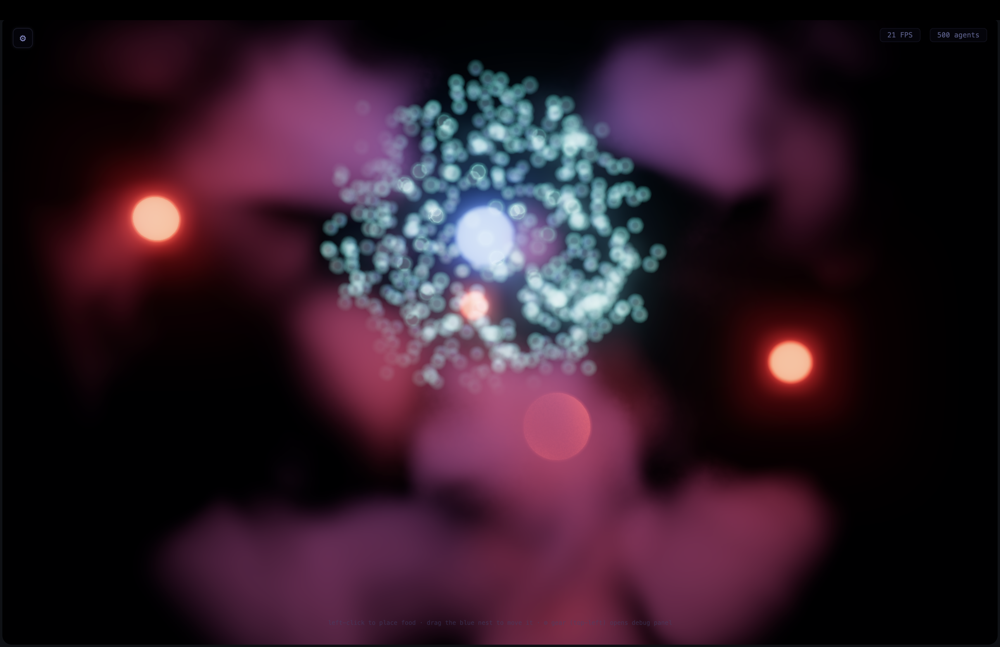
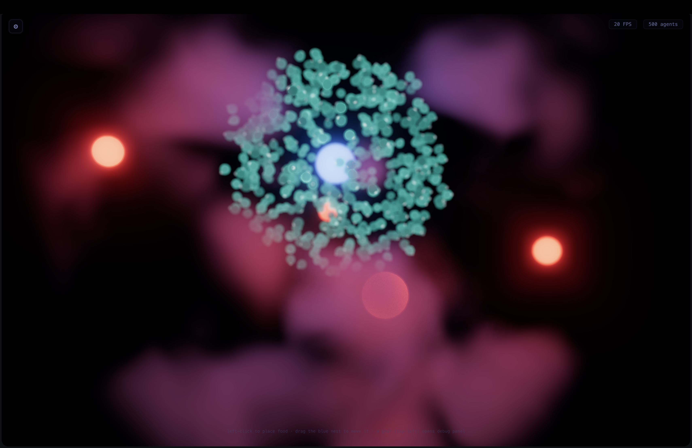

# Sim Sandbox — Style Catalog

A reference of rendering styles used across the sim projects, documenting how
each material, shader, and geometry property maps to a visual effect.

---

## Styles

- [Glassy Additive Orbs (Sentient Orbs)](#glassy-additive-orbs)
- [Cellular Pseudopod (Swarm Intelligence)](#cellular-pseudopod)

---

## Glassy Additive Orbs

**Project:** [`projects/sentient-orbs/`](../projects/sentient-orbs/)



A luminous, translucent, directionless orb — the original agent style. Every
agent is a glowing glass bead: you see a bright halo, not a shape.

### Material

| Property | Value | Visual Effect |
|---|---|---|
| `transparent` | `true` | Background shows through the agent. |
| `blending` | `THREE.AdditiveBlending` | Colour **adds** to the scene behind it — bright spots glow, dark stays dark. No shadows, no occlusion between agents. |
| `depthWrite` | `false` | Agents don't write to the depth buffer — they overlap additively, creating a dense particle-cloud look. |

### Geometry

| Property | Value | Visual Effect |
|---|---|---|
| Type | `IcosahedronGeometry(0.55, 1)` | A 42-vertex icosahedron — smooth enough to read as round at this size. |
| Subdivision | 1 iteration | Very low polycount; efficient for 500+ instances. |

### Fragment Shader

```
core colour  = vColor * 0.2      (very dim centre — the body is mostly empty)
rim colour   = vColor * fres * 1.05  (bright only at glancing angles)
fresnel      = pow(1 - dot(normal, view), 3.0)  (sharp rim falloff)
light pickup = Σ( lightCol / (1 + 0.03 * d²) )  (nearby food/nest tint)
```

| Parameter | Value | Visual Effect |
|---|---|---|
| Core multiplier | `0.2` | The centre of the orb is nearly dark — the body reads as a hollow shell. |
| Rim multiplier | `1.05` | Edges are brightly lit, creating a glass/soap-bubble rim. |
| Fresnel power | `3.0` | Very narrow, sharp rim — only the outermost silhouette glows. |
| Light atten `1 + 0.03·d²` | high range | Food/nest colour tints the rim from a distance. |

### Instance Matrix

Only **translation** — no rotation. Every agent faces the same direction
regardless of where it's moving. The icosahedron is round, so orientation
doesn't matter.

### Animation

```
pulse = 0.75 + 0.25 * sin(time / 320 + i * 0.6)
colour = baseColour * pulse
```

A subtle per-agent brightness pulse at staggered phases — the only hint of
life. No body deformation, no directional cues.

### Summary — Visual Signature

- **Translucency:** high — agents are semi-transparent halos
- **Shape definition:** none — bloom washes the icosahedron into a circle
- **Directionality:** none — agents have no front, back, or orientation
- **Cellular quality:** none — reads as floating glass beads / fireflies
- **Bloom interaction:** strong — additive + low threshold = every agent blooms

---

## Cellular Pseudopod

**Project:** [`projects/swarm-intelligence/`](../projects/swarm-intelligence/)



An opaque, directional, cellular body with a bright leading-edge dot. Every
agent has a front (+Z = velocity), a tapering body that bends on turns, and
a tiny bright dot that protrudes 30% of the body radius in the direction of
travel.

### Material

| Property | Value | Visual Effect |
|---|---|---|
| `transparent` | `false` | Opaque body — you see the actual geometry shape. |
| `blending` | `THREE.NormalBlending` | Normal overwrite — agents occlude each other, solid shapes. |
| `depthWrite` | `true` | Agents write to depth — nearer agents hide farther ones, creating depth layering. |

### Geometry

| Property | Value | Visual Effect |
|---|---|---|
| Type | UV sphere, `createBodyGeometry()` | Smooth sphere with vertex attribute `a_dotWeight`. |
| Rings | 14 | ~420 vertices — smooth enough for deformation. |
| Segments | 12 | Good roundness without over-tessellation. |
| `a_dotWeight` | `max(0, dot(normal, +Z))` | Per-vertex: 1 at front pole, 0 at equator/rear. Drives how much the vertex is pulled toward the dot. |

### Vertex Shader — Deformation

```
dotDir   = normalize(vec3(dotAngleX, dotAngleY, 1.0))    // within 45° of +Z
protrude = dotDir * (protrusion * 0.3 * radius) * dotWeight
bend     = lateral * (latMag * dotWeight * 0.5 * radius)
breathe  = 1 + 0.02 * sin(time * 2 + protrusion * 3)
pos      = (pos + protrude + bend) * breathe
```

| Parameter | Value | Visual Effect |
|---|---|---|
| Protrusion max | `30%` of radius | Dot sticks out ~0.17 world-units at full extension. |
| Cone limit | `45°` from +Z | Dot can't point backward — natural turning limit. |
| Bend amplitude | `latMag × 0.5 × radius` | Front vertices shift sideways up to ~0.14 units — body curves into a crescent. |
| Breathing | `±2%` | Subtle living pulse, imperceptible unless you look for it. |

### Fragment Shader

```
core colour  = vColor * 0.5      (solid, visible centre)
rim colour   = vColor * fres * 0.7  (softer rim than orbs)
fresnel      = pow(1 - dot(normal, view), 3.0)
light pickup = Σ( lightCol * 0.2 / (1 + 0.03 * d²) )  (subtle tint)
```

| Parameter | Value | Visual Effect |
|---|---|---|
| Core multiplier | `0.5` | Body centre is clearly visible — you see the shape. |
| Rim multiplier | `0.7` | Subtle emissive rim, not as bright as orbs. |
| Light atten `0.2 / (1 + 0.03·d²)` | reduced | Environmental tint is present but subtle — doesn't wash out body colour. |

### Instance Matrix

Full **rotation from smoothed velocity**. The body faces the smoothed
direction (`smoothVx/smoothVy/smoothVz`) which lags behind actual velocity
at `BODY_LAG = 0.08` (8% lerp per frame).

When the agent turns:
1. Velocity changes immediately
2. Body direction chases it at 8%/frame
3. The angle between body and velocity drives dot offset + protrusion
4. The dot points in the actual velocity direction (limited to 45° cone)

### Animation

- **Body direction** chases velocity with lag — the body turns smoothly
- **Protrusion** rises and falls with turn angle (lerped at 0.15/frame)
- **Dot** pulses independently on a faster cycle (`time / 180`)
- **Breathing** `±2%` on whole body
- **Tail/bend** varies continuously with turn sharpness

### Dot Sprite

| Property | Value | Visual Effect |
|---|---|---|
| Size | `1.2` world-units | Small, bright point. |
| Material | `AdditiveBlending` | Glows on top of everything. |
| Colour | Cyan (foraging) / Gold (returning) | Matches body colour but brighter. |

### Summary — Visual Signature

- **Translucency:** none — opaque, solid body
- **Shape definition:** strong — you can see the sphere deforming
- **Directionality:** definite — head/dot faces velocity, body lags on turns
- **Cellular quality:** moderate — crescent bend + protrusion + breathing
- **Bloom interaction:** reduced — NormalBlending means only the dot sprite blooms heavily

---

## Property Cheat Sheet

### Material Flags

| Flag | Additive Orbs | Pseudopod | Effect |
|---|---|---|---|
| `transparent` | `true` | `false` | Allows alpha blending vs opaque. |
| `blending` | `Additive` | `Normal` | Add = colour adds to scene (glow). Normal = overwrites (solid). |
| `depthWrite` | `false` | `true` | False = no occlusion (particle-like). True = proper depth sorting. |

### Fresnel Specs

| Style | Core Mul | Rim Mul | Fresnel Power | Rim Width |
|---|---|---|---|---|
| Orbs | `0.2` | `1.05` | `3.0` | Narrow, bright |
| Pseudopod | `0.5` | `0.7` | `3.0` | Wider, softer |

Higher `coreMul` → more visible body shape. Higher `rimMul` → more glassy
halo. Fresnel power > 2 makes the rim narrow; power = 1.0 makes it a broad
gradient across the whole surface.

### Light Pickup

| Style | Attenuation | Diffuse | Effect |
|---|---|---|---|
| Orbs | `1.0 / (1 + 0.03·d²)` | `0.15 + 0.4·diff` | Strong colour bleed from nearby food/nest |
| Pseudopod | `0.2 / (1 + 0.03·d²)` | `0.1 + 0.4·diff` | Subtle tint, body colour dominates |

### Orientation

| Style | Matrix | Effect |
|---|---|---|
| Orbs | Pure translation | No direction — agents float as spheres |
| Pseudopod | Rotation from smoothed velocity | Head always points forward, lags on turns |

---

## Quick-Reference: How to Achieve Each Look

**To get the Glassy Orb look:**
```
material.transparent    = true
material.blending       = THREE.AdditiveBlending
material.depthWrite     = false
core colour             = vColor * 0.2
rim colour              = vColor * fres * 1.05
light attenuation       = 1.0 / (1 + 0.03 * d²)
geometry                = IcosahedronGeometry(radius, 1)
```

**To get the Cellular look:**
```
material.transparent    = false
material.blending       = THREE.NormalBlending
material.depthWrite     = true
core colour             = vColor * 0.5
rim colour              = vColor * fres * 0.7
light attenuation       = 0.2 / (1 + 0.03 * d²)
geometry                = UV sphere with a_dotWeight
instance matrix         = rotation from smoothed velocity
vertex deformation      = protrude + bend along dotDir
```

**To blend both (translucent cellular with visible shape):**
```
material.transparent    = true
material.blending       = THREE.NormalBlending   (or Additive)
material.depthWrite     = false
core colour             = vColor * 0.35
rim colour              = vColor * fres * 0.9
light attenuation       = 0.5 / (1 + 0.03 * d²)
```

---

*Generated from the actual source at commit `aaf5f86`.*
